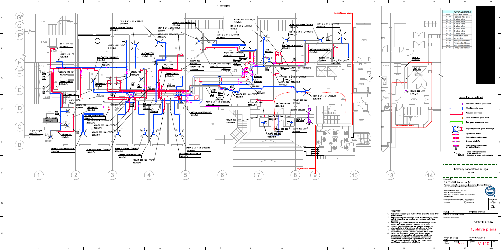
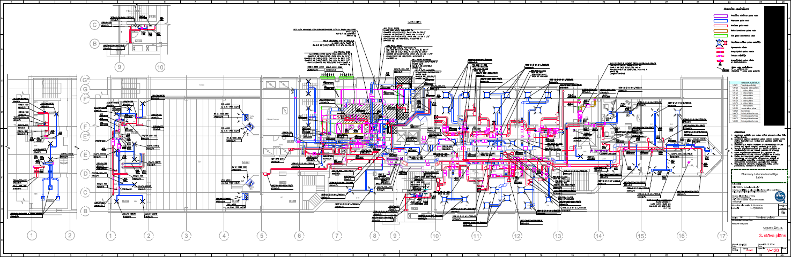
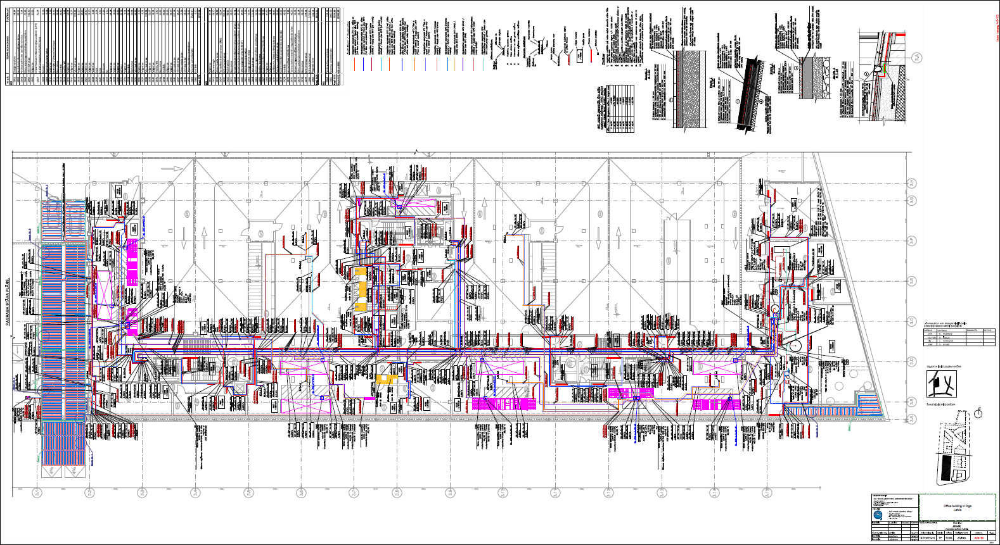
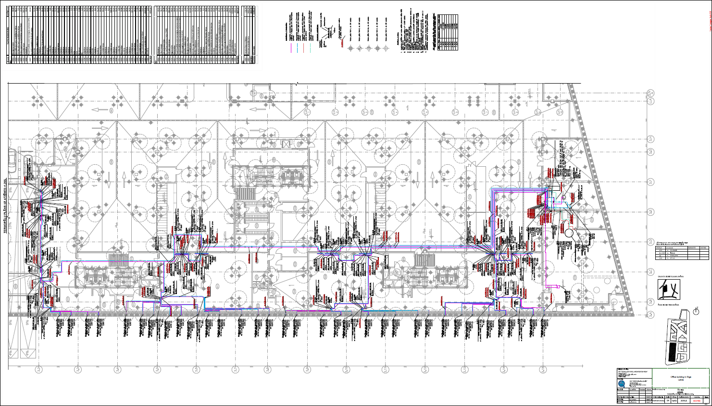
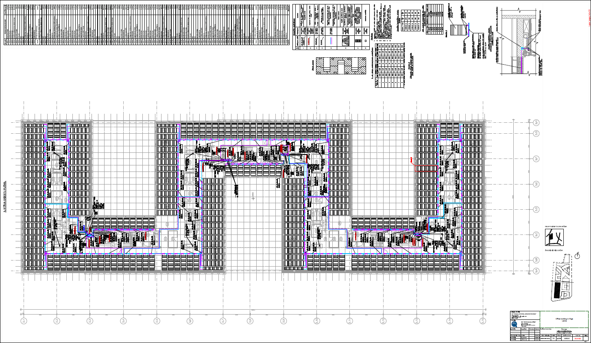
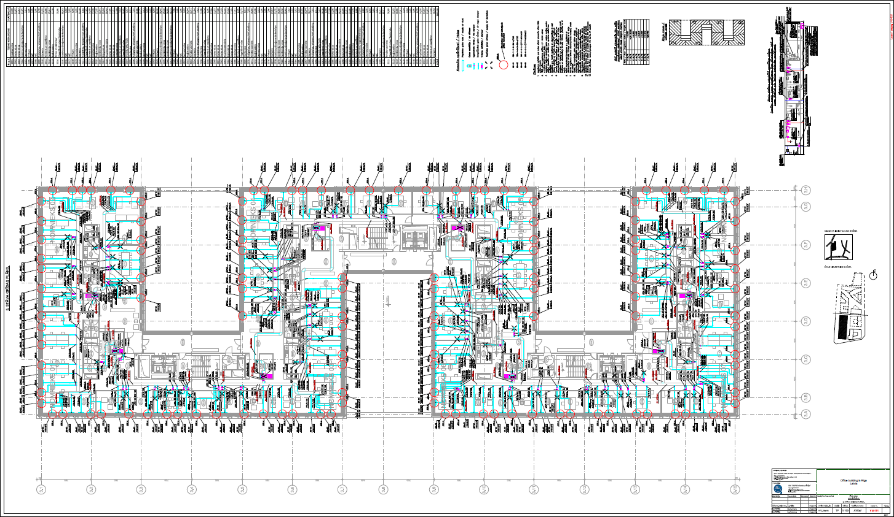
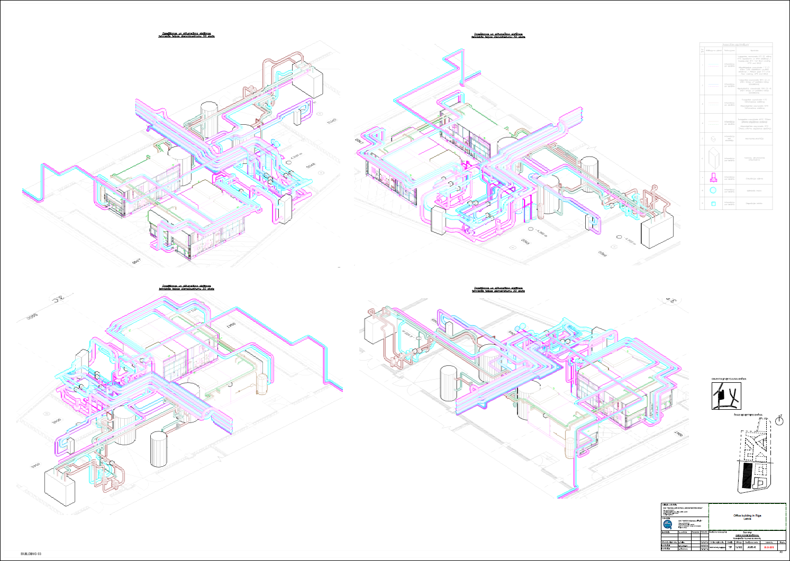
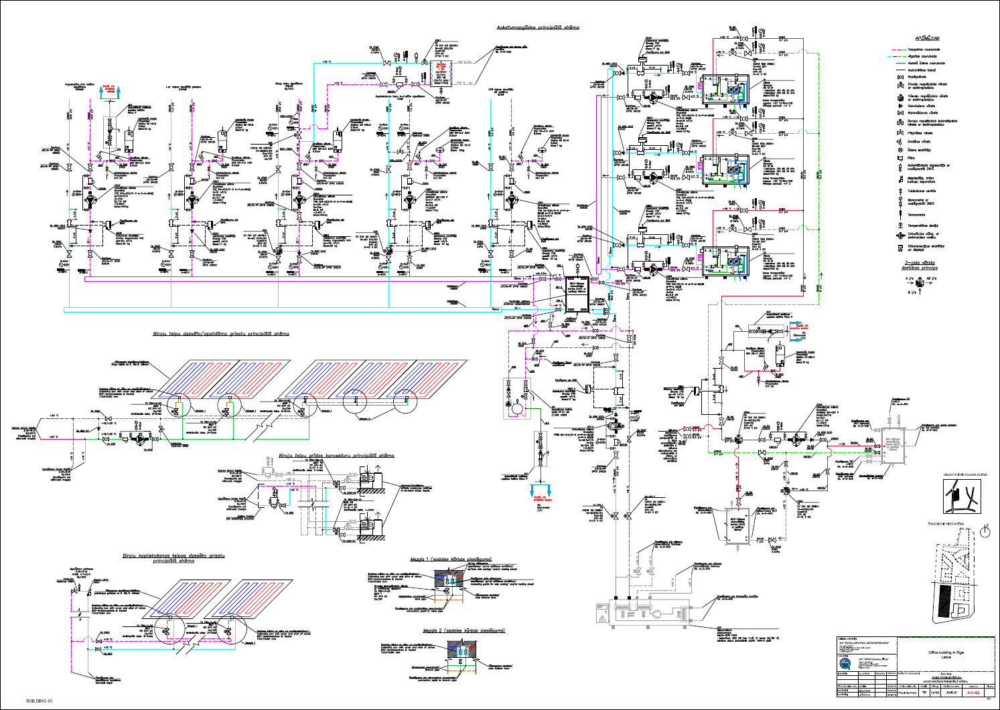
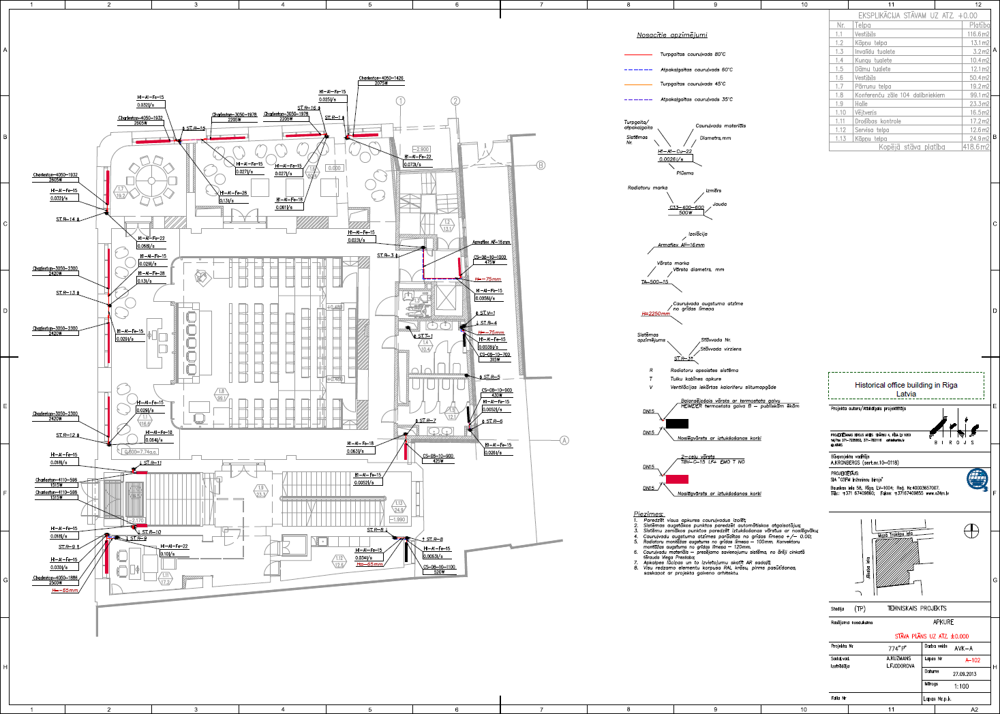
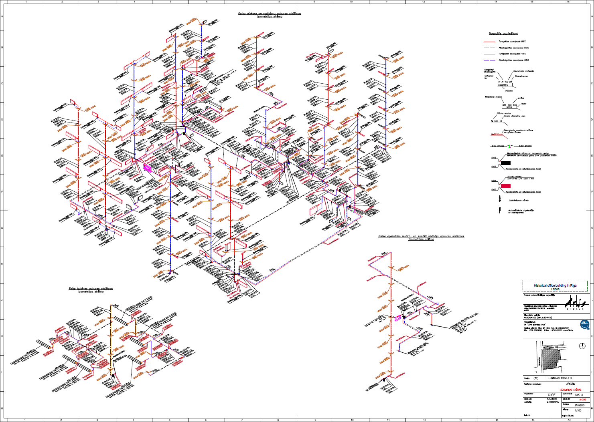

# Lina Fjodorova - civil engineering project examples

Click on preview pictures to download full size documents.

## Pharmacological laboratory HVAC system reconstruction in Riga
Project goal was to perform the HVAC system reconstruction, without interrupting laboratory work, while not making alterations to other engineering systems like sewerage. 

The building consists of pharmacological laboratories, office spaces, social gathering spaces (like a conference hall) and technical rooms. The building has incosistent floor heighs. Part of the building information was available only as a paper plan from the 1960s. Measurements were done on site by ourselves. 

I was tasked to provide high air exchange in laboratory rooms, while not exceeding noise limits, and having all additional equipment (air dampers, sound attenuators, etc.) in technical rooms. 

For this project I designed ventilation, air conditioning and also partially the heating systems.

   
  1st floor ventilation system

   
  2nd floor ventilation system

## Office building HVAC system project in Riga

The goal of this project was to design energy efficient HVAC system using heat pump with thermopiles as energy source. 

Cooling and heating ceilings were used for office spaces to efficiently utilize use of thermopile energy. This building has more than 32 000 m2 design area. We made separate HVAC designs for floors and ceiling, as different technologies were used (for floors above the first). At the final stages of the project, I was tasked to eliminate clashes and interferences between all engineering systems in 3D. 

For this project I designed heating, air conditioning and also partially the ventilation systems.

   
  Basement floor heating system

   
  Under basement thermopile system 

   
  5th floor ceiling plan for air condition system

   
  5th floor floors ventilation system

   
  Isometric view of the technical room 

   
  Cooling system principal schema

## Governmental office building recostruction in Riga
The goal of the project was to reconstruct office building which is cultural monument. Building was originally contructed in 1907 and received an outbuilding and a partial relayout, while not changing the old construction. The old part of the building had to be protected, and any new technologies had to fit the original design (like the type of heating radiators). 

I was tasked to calculate building energy balance, with a challenge of having more than 50 different types of walls. 

For this project I designed heating, air conditioning and the partially ventilation systems; eliminated all clashes and interferences in HVAC systems.  

   
  1st floor heating system

   
  Isometric schema of the heating system

